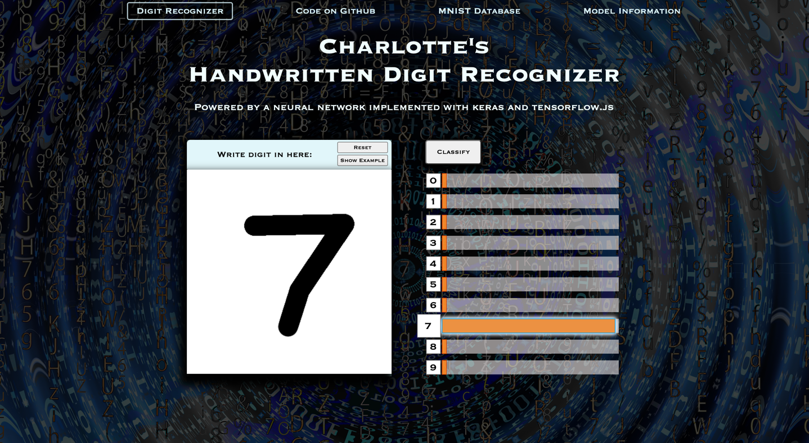

# Charlotte's Handwritten Digit Recognizer
Image classification powered by a neural network implemented with Keras and TensorFlow.js

Try it out yourself at https://anna-charlotte.github.io/digit_recognizer/frontend/index.html



## Usage
Train model:
1. Clone repository: ```git clone https://github.com/anna-charlotte/digit_recognizer.git```
2. Install requirements: ```poetry install```
3. Activate virtual environment: ```poetry shell```
4. Create the data directory:
```mkdir data```
5. Download the data from https://www.kaggle.com/datasets/oddrationale/mnist-in-csv?resource=download and save it to the data directory.
6. Create additional training data: ````python src/create_new_data.py````
7. Train model: ```python src/digit_recognizer.py```

